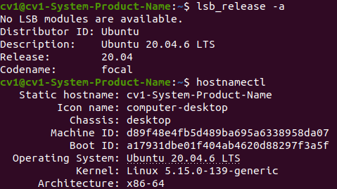

# Ubuntu 환경 확인

## 환경

- **PC**: cv1-System-Product-Name
- **OS**: Ubuntu 20.04.6 LTS
- **Kernel**: 5.15.0-139-generic
- **작성일**: 2026-07-30

## 목표

연구실 PC에는 기존 연구 파일이 저장되어 있어 운영체제를 새로 설치하거나 포맷할 수 없는 상태였다. 따라서 Ubuntu를 재설치하지 않고 현재 설치된 버전만 먼저 확인하였다.

## 진행 과정

### 1. Ubuntu 버전 확인

Ubuntu 버전을 확인하기 위해 다음 명령어를 실행하였다.

```bash
lsb_release -a
```

출력 결과

```text
No LSB modules are available.
Distributor ID: Ubuntu
Description: Ubuntu 20.04.6 LTS
Release: 20.04
Codename: focal
```

Ubuntu가 정상적으로 설치되어 있음을 확인하였다.

### 2. 시스템 정보 확인

실행한 명령어

```bash
hostnamectl
```

출력 결과

```text
Operating System: Ubuntu 20.04.6 LTS
Kernel: Linux 5.15.0-139-generic
Architecture: x86-64
```
ubuntu-version.png
운영체제, 커널 버전 및 시스템 정보를 확인하였다.

## 캡처

`lsb_release -a`,`hostnamectl`  실행 결과를 캡처하여 `images/ubuntu-version.png`에 저장하였다.





## 배운 것 / 다음에 할 것

- Ubuntu 버전을 확인하는 방법을 익혔다.
- 다음 단계에서 기존 NVIDIA 드라이버와 CUDA Toolkit이 정상적으로 동작하는지 확인할 예정이다.