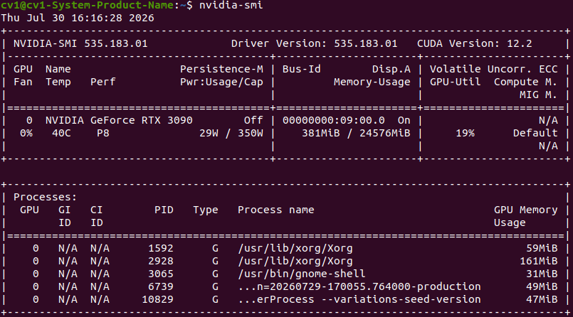
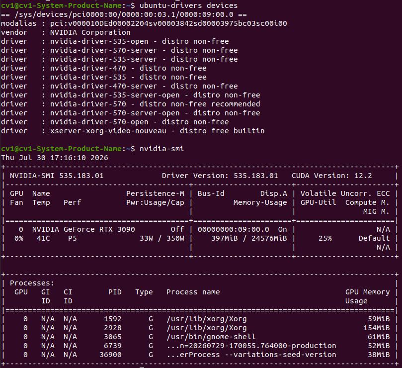
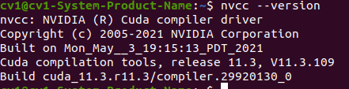

# NVIDIA 드라이버 및 CUDA Toolkit 설치 확인

## 환경
- GPU: NVIDIA GeForce RTX 3090
- OS: Ubuntu 20.04.6 LTS
- NVIDIA Driver: 535.183.01
- Driver 지원 CUDA Version: 12.2
- CUDA Toolkit: 11.3
- 작성일: 2026-07-30

## 목표
NVIDIA GPU를 사용하기 위한 NVIDIA Driver와 CUDA Toolkit 설치 상태를 확인한다.

기존 시스템에 설치된 환경이 존재하므로 재설치하지 않고 현재 환경이 정상적으로 동작하는지 검증한다.

---

## 1. NVIDIA 드라이버 확인

### 1-1. 권장 드라이버 확인

설치 전 NVIDIA GPU에 맞는 권장 드라이버를 확인하였다.

실행한 명령어:

```bash
ubuntu-drivers devices
```

결과:

```text
== /sys/devices/pci0000:00/0000:00:03.1/0000:09:00.0 ==
modalias : pci:v000010DEd00002204sv00003842sd00003975bc03sc00i00
vendor   : NVIDIA Corporation
driver   : nvidia-driver-535 - distro non-free
driver   : nvidia-driver-535-server-open - distro non-free
driver   : nvidia-driver-570 - distro non-free recommended
driver   : nvidia-driver-570-server - distro non-free
driver   : nvidia-driver-535-server - distro non-free
driver   : nvidia-driver-535-open - distro no임을 인증합니다.n-free
driver   : nvidia-driver-570-server-open - distro non-free
driver   : nvidia-driver-570-open - distro non-free
driver   : nvidia-driver-470-server - distro non-free
driver   : nvidia-driver-470 - distro non-free
driver   : xserver-xorg-video-nouveau - distro free builtin
```

확인 결과 현재 GPU에 사용할 수 있는 NVIDIA 드라이버 정보를 확인하였다.


### 1-2. NVIDIA 드라이버 동작 확인

기존에 설치된 NVIDIA 드라이버가 정상적으로 동작하는지 확인하였다.

실행한 명령어:

```bash
nvidia-smi
```

결과:





GPU 정보, Driver Version, CUDA Version이 정상적으로 출력되는 것을 확인하였다.

### 참고
`nvidia-smi`에서 표시되는 CUDA Version은 현재 설치된 CUDA Toolkit 버전이 아니라,
설치된 NVIDIA Driver가 지원 가능한 최대 CUDA 버전을 의미한다.

---

## 2. CUDA Toolkit 확인

### 2-1. CUDA Toolkit 설치 확인

현재 시스템에 CUDA Toolkit이 설치되어 있는지 확인하기 위해 `nvcc` 명령어를 실행한다.

```bash
nvcc --version
```

실행 결과:

```text
nvcc: NVIDIA (R) Cuda compiler driverPython·PyTorch·VS Code

Copyright (c) 2005-2021 NVIDIA Corporation
Built on Mon_May__3_19:15:13_PDT_2021
Cuda compilation tools, release 11.3, V11.3.109
Build cuda_11.3.r11.3/compiler.29920130_0
```

확인 결과:
- CUDA Toolkit 버전: **11.3**
- nvcc compiler 정상 동작 확인

### 2-2. CUDA 버전 확인 결과

`nvidia-smi` 결과:

- GPU: NVIDIA GeForce RTX 3090
- NVIDIA Driver: 535.183.01
- 지원 CUDA Version: 12.2

`nvcc --version` 결과:

- CUDA Toolkit: 11.3

`nvidia-smi`는 NVIDIA Driver가 지원 가능한 최대 CUDA 버전을 표시하며,
`nvcc --version`은 실제 설치된 CUDA Toolkit 버전을 표시한다.
따라서 Driver는 CUDA 12.2를 지원하지만, 현재 설치된 Toolkit은 CUDA 11.3인 상태이다.

## 캡처

`nvidia-smi` `ubuntu-drivers devices`를 통해 권장 드라이버 확인하였다.



`nvcc --version`을 통해 실제로 설치된 CUDA Toolkit의 버전을 확인하였다.


## 배운 것 / 다음에 할 것

- NVIDIA → GPU(그래픽카드)를 만드는 대표적인 회사
- GPU → 그래픽카드에 포함된 연산 장치로, 많은 계산을 동시에 처리하는 데 특화됨  
  (특히 딥러닝, AI 학습, 영상 처리 등에서 사용)
- CPU → 컴퓨터의 전체적인 작업을 처리하는 중앙 처리 장치, 운영체제 실행 및 일반적인 프로그램 연산을 담당
- GPU와 CPU의 차이 → CPU는 적은 수의 복잡한 작업 처리에 강하고, GPU는 많은 양의 단순한 연산을 동시에 처리하는 데 강함
- NVIDIA Driver → Ubuntu 운영체제가 GPU를 인식하고 사용할 수 있도록 GPU와 OS 사이에서 연결해 주는 소프트웨어
- Driver가 필요한 이유 → 운영체제는 GPU의 동작 방식을 직접 알 수 없기 때문에, Driver를 통해 GPU를 제어하고 정상적으로 사용할 수 있음
- CUDA → NVIDIA에서 제공하는 GPU 가속 플랫폼으로, GPU를 활용해 CPU보다 빠르게 병렬 연산을 수행할 수 있도록 해주는 개발 환경
- CUDA가 필요한 이유 → 딥러닝 프레임워크(PyTorch, TensorFlow 등)가 GPU를 사용하여 모델 학습 및 연산 속도를 높일 수 있도록 지원함
