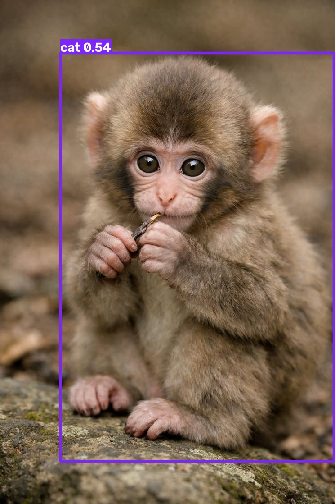
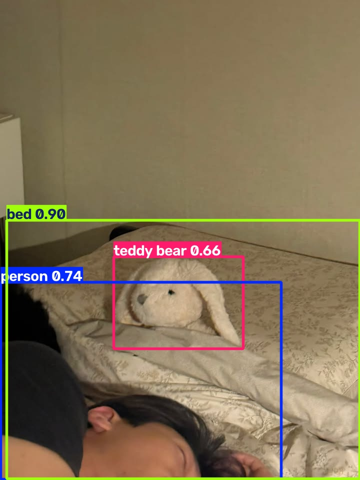
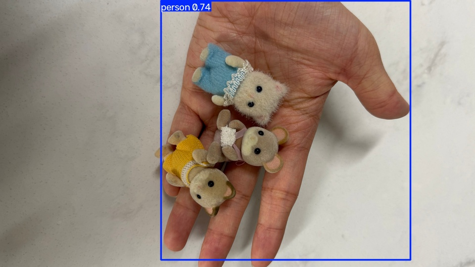
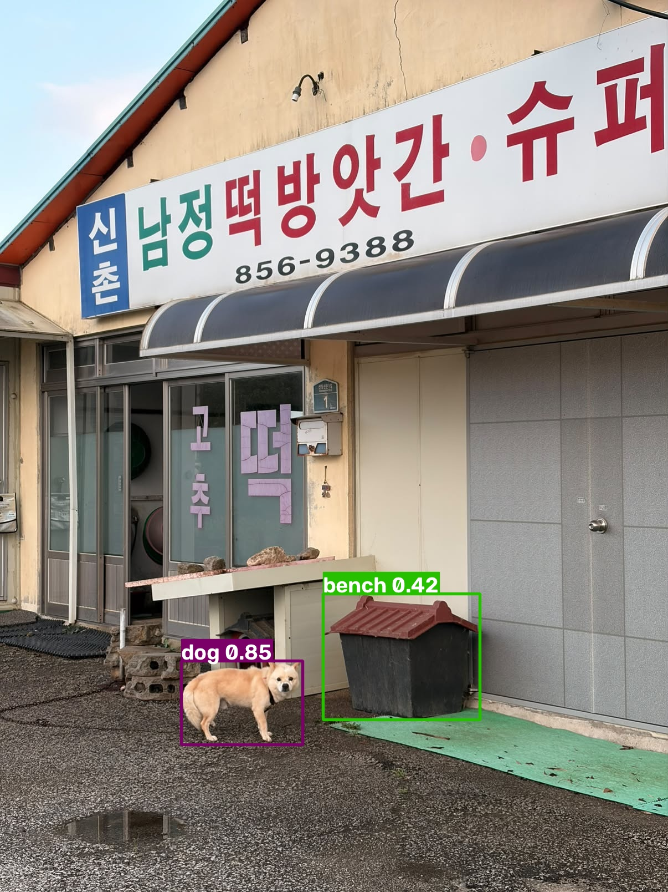
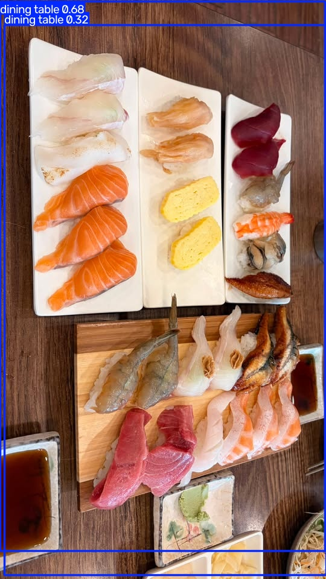
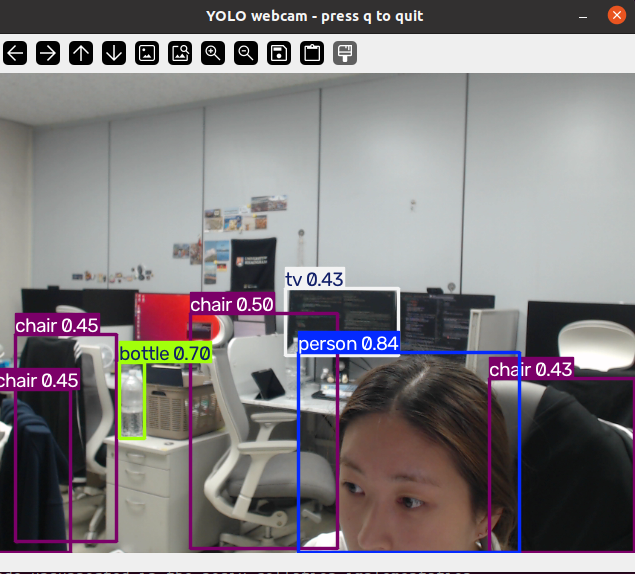
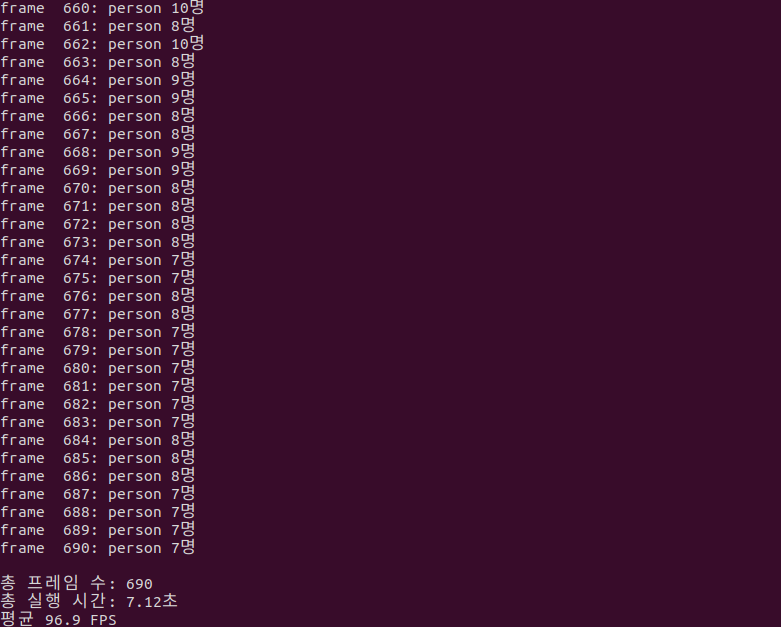
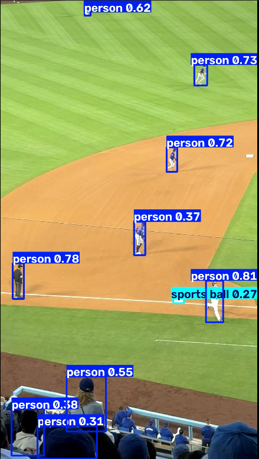
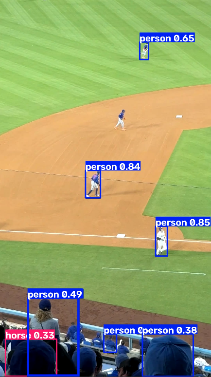

## 1. 첫 이미지 추론

YOLO26n 모델을 사용하여 `images/test.jpg` 이미지에 대한 객체 탐지를 수행하였다.

### 실행 코드

`src/yolo/predict_image.py`

```python
from ultralytics import YOLO

model = YOLO("yolo26n.pt")
results = model("images/test.jpg", save=True)

for box in results[0].boxes:
    cls = model.names[int(box.cls)]
    conf = float(box.conf)
    x1, y1, x2, y2 = box.xyxy[0].tolist()

    print(
        f"{cls:12s} conf={conf:.2f} "
        f"box=({x1:.0f},{y1:.0f},{x2:.0f},{y2:.0f})"
    )
```

### 실행 명령어

```bash
python src/yolo/predict_image.py
```

### 실행 결과

```text
cat          conf=0.54 box=(134,118,743,1024)
```

원본 이미지의 객체를 `cat`으로 잘못 분류하였다. 객체의 형태가 고양이와 비슷하게 인식되어 오분류가 발생한 것으로 추정된다.
그리고 yolo의 클래스 목록 중 monkey가 없다는걸 알게되었다.



### 1-2. 토끼인형



토끼 인형은 해당 클래스가 없어 형태가 유사한 `teddy bear`로 오분류된 것으로 추정된다. 반면 사람과 침대는 각각 올바르게 검출하였다.

### 1-3. 손 위에 있는 인형



손 위에 작은 인형을 올려두었으나, 모델은 손만 검출하고 크기가 작은 인형은 검출하지 못하였다.

### 1-4. 강아지와 개집



강아지는 정확히 검출했지만, 개집은 형태가 직사각형 구조물과 비슷해 bench로 오분류한 것으로 추정된다.

### 1-5. 스시



스시를 한 점씩 구분할 것으로 예상했지만, 모델은 테이블만 검출하고 스시는 검출하지 못했다. 기본 클래스에 sushi가 포함되어 있지 않아 발생한 것으로 추정된다.

## 2. 웹캠 실시간 객체 탐지

웹캠 영상의 각 프레임에 YOLO 객체 탐지를 적용하여 사람과 주변 물체가 실시간으로 탐지되는지 확인하였다.



## 3. 영상 파일 객체 탐지 및 FPS 측정

YOLO26n 모델을 사용하여 영상의 각 프레임에서 사람을 검출하고 평균 처리 속도를 측정하였다.

### 3-1. 실행 코드

코드 파일은 다음 위치에 작성하였다.

```text
src/yolo/predict_video.py
```

```python
import time

from ultralytics import YOLO


model = YOLO("yolo26n.pt")

t0 = time.time()
n = 0

for result in model.predict(
    source="images/people-walking.mp4",
    stream=True,
    conf=0.25,
    device="cuda",
    verbose=False,
):
    n += 1

    persons = [
        box
        for box in result.boxes
        if model.names[int(box.cls.item())] == "person"
    ]

    print(f"frame {n:4d}: person {len(persons)}명")

elapsed_time = time.time() - t0

print(f"\n총 프레임 수: {n}")
print(f"총 실행 시간: {elapsed_time:.2f}초")
print(f"평균 {n / elapsed_time:.1f} FPS")
```

`stream=True`를 사용하여 모든 영상 결과를 메모리에 한꺼번에 저장하지 않고 프레임 단위로 처리하였다.

### 3-2. 실행 명령어

```bash
python src/yolo/predict_video.py
```

### 3-3. 실행 결과



### 3-4. 결과 분석

YOLO26n 모델이 총 `690`개의 프레임을 정상적으로 처리하였다.

전체 영상 처리에는 `7.12초`가 소요되었으며, 평균 처리 속도는 `96.9 FPS`로 측정되었다.


## 4. Confidence Threshold 비교

동일한 영상에서 confidence 값을 `0.1`, `0.25`, `0.5`, `0.8`로 변경하여 검출 결과를 비교하였다.
cp runs/detect/predict_shshi/test.jpg images/result-sushi.jpg
### 실험 조건

- 모델: `yolo26n.pt`
- 영상: `images/people-walking.mp4`
- 이미지 크기: `640`
- 실행 장치: `cuda`

### 실험 결과

| Confidence | 총 검출 박스 수 | 평균 박스 수 | 평균 사람 수 | 평균 FPS |
|---:|---:|---:|---:|---:|
| 0.10 | 10,719 | 15.53 | 10.54 | 38.3 |
| 0.25 | 7,825 | 11.34 | 8.53 | 40.0 |
| 0.50 | 6,222 | 9.02 | 7.13 | 41.9 |
| 0.80 | 4,224 | 6.12 | 4.76 | 42.5 |

### 결과 분석

Confidence가 높아질수록 검출 박스 수와 사람 검출 수가 감소하였다.

낮은 confidence에서는 더 많은 객체를 검출하지만 잘못된 탐지가 증가할 수 있고, 높은 confidence에서는 잘못된 탐지는 줄어들지만 실제 사람도 놓칠 가능성이 커진다.

또한 검출 박스 수가 감소하면서 FPS는 `38.3`에서 `42.5`로 소폭 증가하였다.

## 5. YOLO 모델 크기 비교

동일한 영상에서 YOLO26n, YOLO26s, YOLO26m 모델의 검출 결과와 처리 속도를 비교하였다.

### 실험 조건

- 영상: `images/people-walking.mp4`
- Confidence: `0.25`
- 이미지 크기: `640`
- 실행 장치: `cuda`

### 실험 결과

| 모델 | 총 검출 박스 수 | 평균 박스 수 | 평균 사람 수 | 평균 FPS |
|---|---:|---:|---:|---:|
| YOLO26n | 7,825 | 11.34 | 8.53 | 107.4 |
| YOLO26s | 9,427 | 13.66 | 9.16 | 105.1 |
| YOLO26m | 10,340 | 14.99 | 9.34 | 97.2 |

### 결과 분석

모델 크기가 커질수록 검출 박스 수와 사람 검출 수가 증가하였다.

YOLO26n은 `107.4 FPS`로 가장 빨랐고, YOLO26m은 가장 많은 객체를 검출했지만 처리 속도는 `97.2 FPS`로 가장 느렸다.

따라서 작은 모델은 속도가 빠르고, 큰 모델은 더 많은 객체를 검출하는 경향을 확인하였다.

## 6. 입력 이미지 크기 비교

동일한 영상에서 `imgsz`를 `320`, `640`, `1280`으로 변경하여 검출 결과와 처리 속도를 비교하였다.

### 실험 조건

- 모델: `yolo26n.pt`
- 영상: `images/people-walking.mp4`
- Confidence: `0.25`
- 실행 장치: `cuda`

### 실험 결과

| 이미지 크기 | 총 검출 박스 수 | 평균 박스 수 | 평균 사람 수 | 평균 FPS |
|---:|---:|---:|---:|---:|
| 320 | 5,815 | 8.43 | 6.73 | 42.2 |
| 640 | 7,825 | 11.34 | 8.53 | 40.2 |
| 1280 | 10,023 | 14.53 | 10.29 | 36.2 |

### 결과 분석

입력 이미지 크기가 커질수록 총 검출 박스 수와 사람 검출 수가 증가하였다.

`imgsz=1280`에서 가장 많은 객체를 검출했지만 처리 속도는 `36.2 FPS`로 가장 느렸고, `imgsz=320`에서는 검출 수가 가장 적었지만 `42.2 FPS`로 가장 빨랐다.

따라서 큰 이미지 크기는 멀리 있거나 작게 보이는 객체 검출에 유리하지만, 연산량이 증가하여 처리 속도가 감소하는 것을 확인하였다.

## 7. CPU와 GPU 처리 속도 비교

동일한 조건에서 실행 장치만 CPU와 GPU로 변경하여 처리 속도를 비교하였다.

| 실행 장치 | 총 검출 박스 수 | 평균 사람 수 | 평균 FPS |
|---|---:|---:|---:|
| GPU (`cuda`) | 7,825 | 8.53 | 103.8 |
| CPU | 7,825 | 8.53 | 36.4 |

GPU와 CPU의 검출 결과는 동일했지만, GPU는 CPU보다 약 `2.85배` 빠르게 영상을 처리하였다.

```text
103.8 ÷ 36.4 = 약 2.85배
```

## 8. 직접 촬영 영상 실패 사례

### 실패 사례 1: sports ball로 오분류



경기장의 흰 네모 영역이 그라운드와 대비를 이루어 작은 공과 비슷한 특징으로 인식된 것으로 추정된다. 

### 실패 사례 2: horse로 오분류



관중의 신체가 다른 사람과 좌석에 가려져 형태가 불분명해 horse로 오분류한 것으로 추정된다. Confidence도 0.33으로 낮았다.
