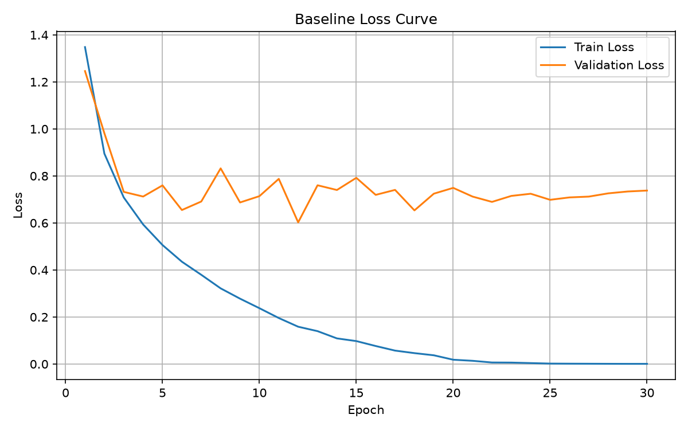
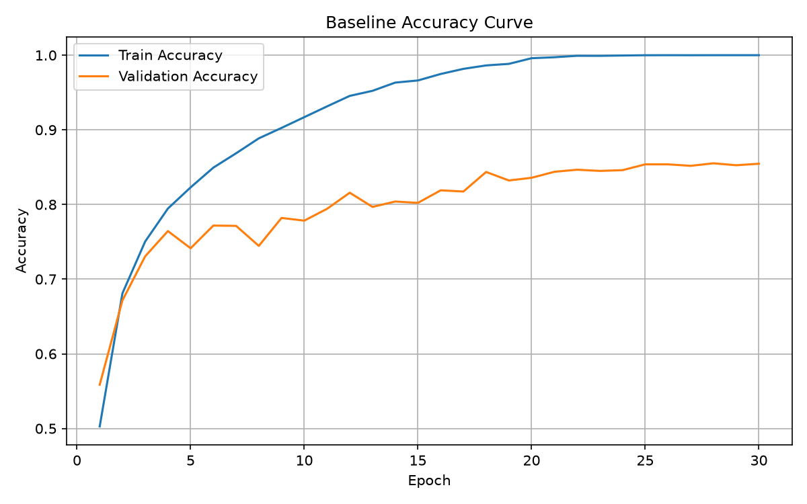
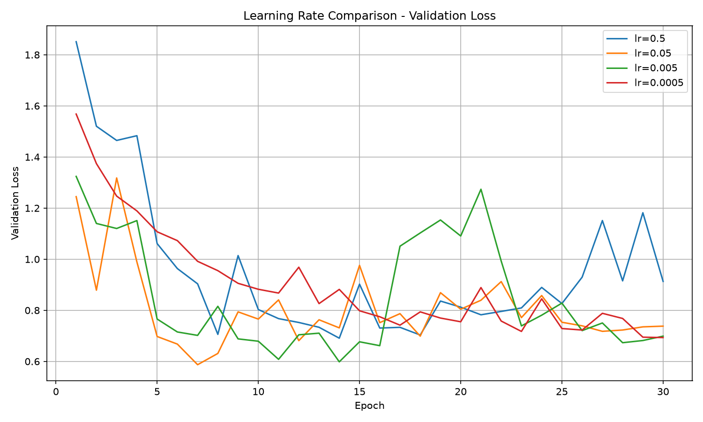
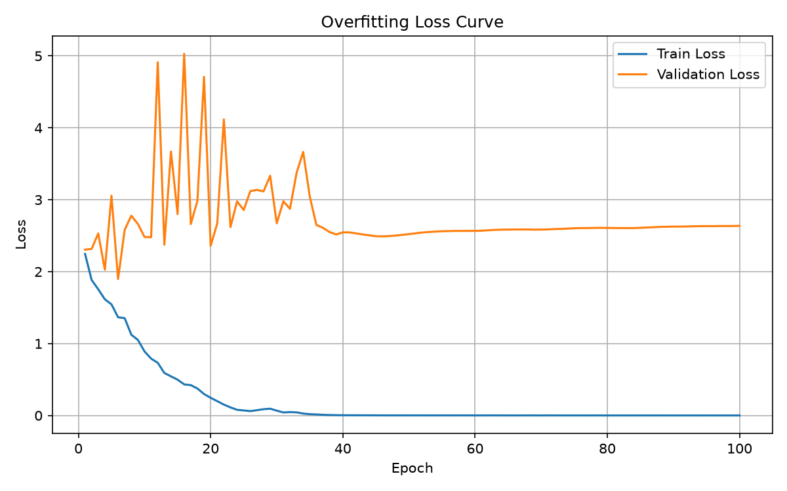
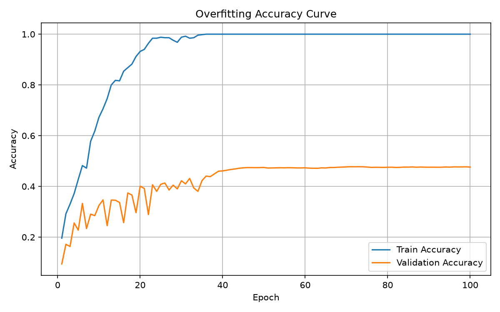
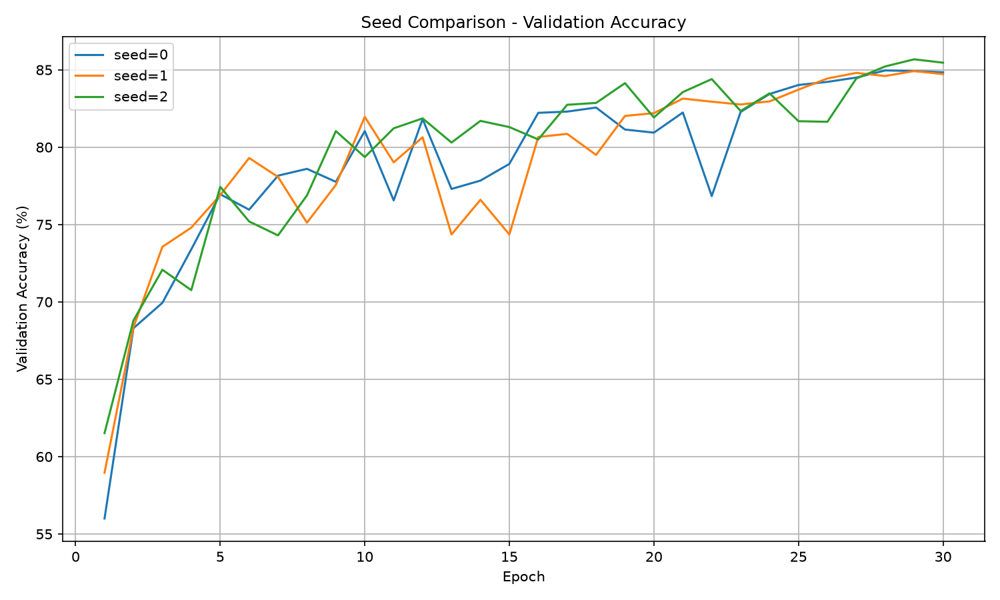

# CIFAR-10 학습 실험 노트

> test set은 Day 5에 최초 1회만 확인한다.  
> 그 이전의 모든 판단은 validation set만으로 내린다.

## 환경

- Dataset: CIFAR-10
- Train / Validation / Test: 45,000 / 5,000 / 10,000
- Seed: 42
- GPU:NVIDIA GeForce RTX 3090 (24GB)
- PyTorch:python -c "import torch; print(torch.__version__)"
- W&B 프로젝트: https://wandb.ai/naso06/cifar10-onboarding

## Baseline 설정

| 항목 | 설정 |
|---|---|
| Model | SmallCNN |
| width | 32 |
| dropout | 0.0 |
| Optimizer | SGD |
| Learning rate | 0.05 |
| Momentum | 0.9 |
| Weight decay | 0 |
| Loss | CrossEntropyLoss |
| Batch size | 128 |
| Epochs | 30 |
| Augmentation | 없음 |
| Scheduler | 없음 |

## Baseline 학습 결과

- Best Validation Loss: 0.5871
- Best Validation Loss Epoch: 7
- Best Validation Accuracy: 85.40%
- Best Validation Accuracy Epoch: 30
- 마지막 epoch의 Validation Accuracy: 85.40%

Train loss는 학습이 진행될수록 계속 감소했고 Train accuracy는 100%까지 올라갔다.

Validation accuracy는 약 85%까지 올라갔지만, Train accuracy와 비교했을 때 차이가 나타났다.

Validation Loss 기준 best epoch은 7이고 Validation Accuracy 기준 best epoch은 30으로 서로 다른 결과가 나왔다.

### Loss Curve

### Accuracy Curve

## 실험 기록

| # | Run 이름 | 바꾼 것 | Best Val Acc | Best Epoch | 소요 시간 | 해석 |
|---|---|---|---|---|---|---|
| 0 | `base_w32_lr0.05_s42` | Baseline | 85.40% | 30 |  | Train accuracy는 100%까지 올라갔지만 Validation accuracy는 약 85%에서 정체되었다. |
| 1 | `overfit_w64_n500_s42` | Train 500장, width=64 | 47.76% | 71 |  | Train accuracy는 100%까지 올라갔지만 Validation accuracy는 약 47%에서 정체되어 과적합이 나타났다. |
| 2 | `train500_w32_lr0.05_s42` | Train size 500 | 41.94% | 30 |  | Train accuracy는 100%까지 올라갔지만 Validation accuracy는 41.94%에 그쳐 데이터가 적을 때 과적합이 크게 나타났다. |
| 3 | `train2000_w32_lr0.05_s42` | Train size 2,000 | 57.86% | 30 |  | Train 데이터를 500장에서 2,000장으로 늘리자 Validation accuracy가 41.94%에서 57.86%로 증가했다. |
| 4 | `train10000_w32_lr0.05_s42` | Train size 10,000 | 74.48% | 26 |  | Train 데이터를 10,000장으로 늘리자 Validation accuracy가 74.48%까지 증가하여 데이터 수가 많아질수록 일반화 성능이 향상되는 경향을 확인했다. |
| 5 | `width16_n45000_lr0.05_s42` | Width 16 | 79.38% | 15 |  | Width를 16으로 줄이자 Validation accuracy가 baseline의 85.40%보다 낮은 79.38%로 감소했다. 모델의 표현력이 줄어든 영향으로 볼 수 있다. |
| 6 | `width64_n45000_lr0.05_s42` | Width 64 | 88.24% | 24 |  | Width를 64로 늘리자 Validation accuracy가 88.24%로 증가했다. 이번 실험에서는 모델의 용량을 키웠을 때 성능이 향상되었다. |
| 7 | `aug_crop_w32_n45000_s42` | RandomCrop | 85.14% | 29 |  | RandomCrop을 적용했을 때 Validation accuracy는 85.14%로 baseline의 85.40%와 큰 차이가 없었다. 이번 실험에서는 RandomCrop 단독 효과가 크지 않았다. |
| 8 | `aug_crop_flip_w32_n45000_s42` | RandomCrop + HorizontalFlip | 86.98% | 30 |  | RandomCrop과 HorizontalFlip을 함께 적용했을 때 Validation accuracy가 86.98%로 baseline보다 높아졌다. 두 augmentation을 함께 사용했을 때 일반화 성능이 향상되었다. |
| 9 | `wd1e-4_w32_n45000_s42` | Weight Decay 1e-4 | 83.84% | 24 |  | Weight Decay를 1e-4로 적용했을 때 Validation accuracy가 83.84%로 baseline보다 낮아졌다. 이번 설정에서는 정규화 효과가 성능 향상으로 이어지지 않았다. |
| 10 | `wd5e-4_w32_n45000_s42` | Weight Decay 5e-4 | 80.96% | 18 |  | Weight Decay를 5e-4로 증가시키자 Validation accuracy가 80.96%로 더 낮아졌다. 이번 실험에서는 정규화를 강하게 적용할수록 성능이 감소하는 경향이 나타났다. |
| 11 | `wd5e-3_w32_n45000_s42` | Weight Decay 5e-3 | 71.72% | 23 |  | Weight Decay를 5e-3까지 크게 적용하자 Validation accuracy가 71.72%로 크게 감소했다. 정규화를 너무 강하게 적용하면 모델 학습을 방해할 수 있음을 확인했다. |
| 12 | `dropout03_w32_n45000_s42` | Dropout 0.3 | 82.84% | 21 |  | Dropout을 0.3으로 적용했을 때 Validation accuracy가 82.84%로 baseline보다 낮아졌다. 이번 설정에서는 Dropout이 일반화 성능 향상으로 이어지지 않았다. |
| 13 | `dropout05_w32_n45000_s42` | Dropout 0.5 | 83.34% | 30 |  | Dropout을 0.5로 적용했을 때 Validation accuracy는 83.34%로 baseline보다 낮았다. 이번 설정에서는 Dropout이 성능 향상에 도움이 되지 않았다. |
| 14 | `lr0.5_w32_n45000_s42` | Learning Rate 0.5 | 79.72% | 30 |  | Learning Rate를 0.5로 크게 설정했을 때 Validation accuracy가 79.72%로 baseline보다 낮아졌다. 학습률이 너무 크면 안정적으로 수렴하기 어려울 수 있음을 확인했다. |
| 15 | `lr0.005_w32_n45000_s42` | Learning Rate 0.005 | 83.66% | 28 |  | Learning Rate를 0.005로 낮췄을 때 Validation accuracy는 83.66%로 baseline보다 조금 낮았다. 학습은 안정적이었지만 30 epoch 안에서는 baseline보다 충분히 수렴하지 못한 것으로 볼 수 있다. |
| 16 | `lr0.0005_w32_n45000_s42` | Learning Rate 0.0005 | 76.38% | 29 |  | Learning Rate를 0.0005로 매우 작게 설정하자 Validation accuracy가 76.38%에 그쳤다. 학습 속도가 느려 30 epoch 안에 충분히 수렴하지 못한 것으로 볼 수 있다. |
| 17 | `cosine_w32_n45000_s42` | CosineAnnealingLR | 85.48% | 22 |  | CosineAnnealingLR을 적용했을 때 Validation accuracy는 85.48%로 baseline과 거의 차이가 없었다. 최종 성능보다는 learning rate 감소에 따른 loss 변화 양상을 확인할 필요가 있다. |
| 18 | `batch32_w32_n45000_s42` | Batch Size 32 | 85.22% | 23 |  | Batch Size를 32로 줄였을 때 Validation accuracy는 85.22%로 baseline과 거의 차이가 없었다. 성능 차이보다는 학습 시간 차이도 함께 비교할 필요가 있다. |
| 19 | `batch512_w32_n45000_s42` | Batch Size 512 | 84.36% | 28 |  | Batch Size를 512로 늘렸을 때 Validation accuracy는 84.36%로 baseline보다 조금 낮았다. 이번 실험에서는 Batch Size 32, 128, 512 사이의 정확도 차이가 크지 않았다. |

### Train Size 비교

| Train Size | Best Val Accuracy |
|---:|---:|
| 500 | 41.94% |
| 2,000 | 57.86% |
| 10,000 | 74.48% |
| 45,000 | 85.40% |

Train 데이터의 크기를 증가시킬수록 Validation Accuracy가 지속적으로 상승했다.

500장을 사용했을 때는 41.94%였지만,
2,000장에서는 57.86%, 10,000장에서는 74.48%,
45,000장에서는 85.40%까지 증가했다.

이를 통해 같은 모델과 하이퍼파라미터를 사용하더라도
학습 데이터의 양이 증가하면 일반화 성능이 향상되는 것을 확인했다.

### Width 비교

| Width | Best Val Accuracy |
|---:|---:|
| 16 | 79.38% |
| 32 | 85.40% |
| 64 | 88.24% |

Width가 16일 때 Validation Accuracy는 79.38%였고,
32에서는 85.40%, 64에서는 88.24%로 증가했다.

이번 실험에서는 모델의 width가 커질수록 Validation Accuracy가 높아졌다.
모델의 표현력이 증가하면서 CIFAR-10 데이터를 더 잘 학습한 것으로 볼 수 있다.

### Augmentation 비교

| Augmentation | Best Val Accuracy |
|---|---:|
| 없음 | 85.40% |
| RandomCrop | 85.14% |
| RandomCrop + HorizontalFlip | 86.98% |

RandomCrop만 적용했을 때는 Validation Accuracy가 85.14%로
baseline의 85.40%와 거의 차이가 없었다.

반면 RandomCrop과 HorizontalFlip을 함께 적용했을 때는
Validation Accuracy가 86.98%까지 증가했다.

이번 실험에서는 RandomCrop 단독보다는
HorizontalFlip을 함께 적용했을 때 일반화 성능이 더 좋아졌다.

### Weight Decay 비교

| Weight Decay | Best Val Accuracy |
|---:|---:|
| 0 | 85.40% |
| 1e-4 | 83.84% |
| 5e-4 | 80.96% |
| 5e-3 | 71.72% |

Weight Decay를 증가시킬수록 Validation Accuracy가 지속적으로 감소했다.

Weight Decay가 0일 때 85.40%로 가장 높은 성능을 보였고,
1e-4에서는 83.84%, 5e-4에서는 80.96%,
5e-3에서는 71.72%까지 감소했다.

이번 실험에서는 Weight Decay를 강하게 적용할수록
모델의 학습이 지나치게 제한되어 성능이 낮아진 것으로 볼 수 있다.

### Dropout 비교

| Dropout | Best Val Accuracy |
|---:|---:|
| 0.0 | 85.40% |
| 0.3 | 82.84% |
| 0.5 | 83.34% |

Dropout을 적용하지 않았을 때 Validation Accuracy가 85.40%로 가장 높았다.

Dropout 0.3에서는 82.84%, Dropout 0.5에서는 83.34%로
두 설정 모두 baseline보다 낮은 성능을 보였다.

이번 실험에서는 Dropout을 적용하는 것보다
Dropout 없이 학습한 baseline이 더 좋은 성능을 보였다.

### Learning Rate 비교

| Learning Rate | Best Val Accuracy |
|---:|---:|
| 0.5 | 79.72% |
| 0.05 | 85.40% |
| 0.005 | 83.66% |
| 0.0005 | 76.38% |

Learning Rate가 0.05일 때 Validation Accuracy가 85.40%로 가장 높았다.

Learning Rate가 0.5로 너무 큰 경우에는 Validation Accuracy가 79.72%로 낮아졌고,
0.0005로 너무 작은 경우에는 학습 속도가 느려 30 epoch 안에 충분히 수렴하지 못했다.

이번 실험에서는 0.05가 네 가지 Learning Rate 중 가장 적절한 값을 보였다.

### Learning Rate별 Validation Loss 곡선

Learning Rate가 0.5일 때는 loss가 비교적 불안정하게 변화했고,
0.05에서는 빠르게 감소하며 비교적 좋은 성능을 보였다.

0.005에서는 더 천천히 감소했으며,
0.0005에서는 30 epoch 동안에도 loss가 계속 감소하는 모습을 보여
학습률이 너무 작으면 수렴 속도가 느려질 수 있음을 확인했다.

### Batch Size 비교

| Batch Size | Best Val Accuracy |
|---:|---:|
| 32 | 85.22% |
| 128 | 85.40% |
| 512 | 84.36% |

Batch Size 32에서는 Validation Accuracy가 85.22%,
128에서는 85.40%, 512에서는 84.36%로 나타났다.

세 설정의 성능 차이는 크지 않았으며,
이번 실험에서는 Batch Size 128이 가장 높은 Validation Accuracy를 보였다.

Batch Size 실험은 정확도뿐 아니라 학습 소요 시간도 비교해야 하므로,
각 run의 실행 시간을 W&B에서 확인하여 함께 기록할 예정이다.

## 과적합 실험

### 설정

- Train size: 500장 (클래스당 50장)
- Validation size: 5,000장
- Width: 64
- Epochs: 100
- Augmentation: 없음
- Dropout: 0.0

### 결과

- Train Accuracy가 100%에 도달한 epoch: 36
- Best Validation Loss: 1.8981
- Best Validation Loss Epoch: 6
- Best Validation Accuracy: 47.76%
- Best Validation Accuracy Epoch: 71
- 마지막 Validation Loss: 2.6371
- 마지막 Validation Accuracy: 47.62%

Train 데이터가 500장으로 적은 상태에서 모델의 width를 64로 키워 학습한 결과,
Train Accuracy는 100%까지 올라갔지만 Validation Accuracy는 약 47%에서 정체되었다.

Train Loss는 거의 0까지 감소한 반면 Validation Loss는 후반부에 다시 증가하여
Train 데이터에 과적합되는 모습을 확인할 수 있었다.

또한 Validation Loss 기준 best epoch은 6이고,
Validation Accuracy 기준 best epoch은 71로 두 기준에서 선택되는 epoch이 크게 달랐다.

### 과적합 학습 곡선

Train Accuracy는 학습이 진행되면서 100%까지 올라갔지만,
Validation Accuracy는 약 47%에서 정체되었다.

Train Loss는 거의 0까지 감소했지만 Validation Loss는 높은 값을 유지했고,
후반부에는 다시 조금씩 증가하는 모습을 보였다.

이를 통해 모델이 적은 Train 데이터에는 매우 잘 맞지만,
새로운 데이터에는 성능이 좋아지지 않는 과적합 현상을 확인했다.

### Early Stopping 및 Checkpoint

- Patience: 10
- Early stopping epoch: 15
- Best Validation Loss: 1.8253
- Best Validation Loss Epoch: 5
- Best Validation Accuracy: 38.36%
- Best Validation Accuracy Epoch: 13
- Checkpoint: `checkpoints/best.pt`

Validation Loss가 개선될 때마다 모델의 `state_dict`를 저장하고,
10 epoch 동안 개선이 없으면 학습을 중단하도록 설정하였다.

Epoch 5에서 Validation Loss가 1.8253으로 가장 낮았고,
이후 10 epoch 동안 더 낮아지지 않아 Epoch 15에서 학습이 종료되었다.

저장한 checkpoint를 다시 불러와 평가한 결과 Validation Loss가
1.8253으로 동일하게 나와 저장된 모델이 정상적으로 재현되는 것을 확인했다.

Validation Loss 기준 best epoch은 5였지만,
Validation Accuracy 기준 best epoch은 13으로 서로 다른 결과가 나왔다.
따라서 어떤 지표를 기준으로 모델을 선택하는지에 따라 선택되는 모델이 달라질 수 있음을 확인했다.

## Seed 편차

| Seed | Best Val Accuracy |
|---|---:|
| 0 | 84.96% |
| 1 | 84.92% |
| 2 | 85.68% |

- 평균: 85.19%
- 표준편차: 0.35%p
- 유의미한 성능 차이의 기준: 약 0.35%p보다 작은 차이는 seed에 따른 변동 범위일 수 있으므로 성능 향상이라고 단정하지 않는다.

세 실험의 평균은 85.19%였고 표준편차는 약 0.35%p였다.

### Seed별 Validation Accuracy 곡선

세 seed의 학습 곡선은 전체적인 형태는 비슷했지만,
epoch별 Validation Accuracy와 최고 성능에는 약간의 차이가 나타났다.

이를 통해 같은 코드와 하이퍼파라미터를 사용하더라도 seed에 따라 결과가 달라질 수 있음을 확인했다.

## 데이터 누수 실험

| 방법 | Validation Accuracy | Test Accuracy |
|---|---:|---:|
| 올바른 Split | 53.00% | 44.37% |
| 잘못된 Split | 80.33% | 44.90% |

올바른 Split에서는 Validation Accuracy가 53.00%, Test Accuracy가 44.37%로 나타났다.

반면 augmentation을 먼저 수행한 뒤 Train과 Validation으로 나눈 잘못된 Split에서는
Validation Accuracy가 80.33%까지 크게 증가했지만,
Test Accuracy는 44.90%로 올바른 방법과 거의 차이가 없었다.

잘못된 Split에서는 같은 원본 이미지에서 만들어진 변형 이미지가
Train과 Validation에 동시에 포함되면서 데이터 누수가 발생했다.

그 결과 Validation 성능은 실제보다 높게 측정되었지만,
새로운 Test 데이터에 대한 일반화 성능은 향상되지 않았다.

이를 통해 Validation 점수가 높다고 해서 항상 모델의 실제 성능이 좋은 것은 아니며,
데이터를 어떻게 분리했는지가 성능 평가에 큰 영향을 줄 수 있음을 확인했다.

## Validation / Test 비교

| 모델 | Validation Accuracy | Test Accuracy | 차이 |
|---|---:|---:|---:|
| SmallCNN width=64 | 88.36% | 87.36% | 1.00%p |

지금까지의 실험 결과를 기준으로 Validation Accuracy가 가장 높았던
SmallCNN width=64 모델을 최종 모델로 선택하였다.

최종 모델의 Validation Accuracy는 88.36%였고,
Test Accuracy는 87.36%로 1.00%p 낮게 나타났다.

여러 실험을 진행하면서 Validation set을 반복적으로 확인하고
그중 가장 좋은 설정을 선택했기 때문에 Validation 성능에는
해당 Validation set에 잘 맞았던 정도가 일부 반영될 수 있다.

따라서 최종 성능을 평가할 때는 Validation 성능만 보는 것이 아니라
별도로 분리해 둔 Test set을 사용하는 것이 중요하다는 것을 확인했다.

## SmallCNN / ResNet18 비교

| 모델 | 학습 방식 | Best Validation Accuracy |
|---|---|---:|
| SmallCNN | Scratch | 48.56% |
| ResNet18 | Scratch | 33.36% |
| ResNet18 | ImageNet Pretrained | 76.38% |

Train 데이터 500장 조건에서 세 모델을 비교하였다.

SmallCNN을 처음부터 학습했을 때 Validation Accuracy는 48.56%였고,
ResNet18을 처음부터 학습했을 때는 33.36%로 가장 낮은 성능을 보였다.

반면 ImageNet으로 미리 학습된 ResNet18을 fine-tuning한 결과
Validation Accuracy가 76.38%로 크게 증가했다.

데이터가 500장으로 적은 상황에서는 많은 파라미터를 가진 ResNet18을
처음부터 학습하기에는 데이터가 부족했던 것으로 볼 수 있다.

반면 pretrained ResNet18은 ImageNet 학습을 통해 이미 기본적인
이미지 특징을 학습한 상태에서 CIFAR-10에 맞게 fine-tuning했기 때문에
적은 데이터에서도 높은 성능을 보인 것으로 생각한다.

또한 기본 ResNet18은 첫 번째 7×7 convolution에서 stride 2를 사용하고
이후 MaxPooling까지 수행하기 때문에 32×32 크기의 CIFAR-10 이미지에서는
초기 단계부터 공간 정보가 빠르게 줄어든다.

이러한 구조도 CIFAR-10에서 ResNet18 scratch의 성능이 낮게 나타난
원인 중 하나일 수 있다.

## 곡선 진단 8문항

### 1.
Train loss는 계속 떨어지고 Train accuracy는 99%인데 Validation loss는 8 epoch째 상승 중이다.

답:Train 성능은 계속 좋아지고 있지만 Validation loss가 계속 상승하고 있으므로 과적합이 진행되고 있다고 판단한다.
Validation 성능이 가장 좋았던 시점의 checkpoint를 사용하고, 필요하다면 augmentation이나 정규화를 적용해 과적합을 줄여볼 것이다.
이번 과적합 실험에서도 Train Accuracy는 100%까지 올라갔지만 Validation Loss는 다시 증가하는 모습을 확인했다.

### 2.
Train loss와 Validation loss가 모두 높은 상태에서 5 epoch째 평평하다.

답:Train과 Validation loss가 모두 높은 상태라면 모델이 데이터 자체를 충분히 학습하지 못한 underfitting 가능성을 먼저 생각할 것이다.
Learning Rate가 너무 작지 않은지 확인하고, 모델의 width를 키우거나 학습률을 조정해 다시 학습해볼 것이다.
이번 실험에서도 width를 16에서 32, 64로 증가시켰을 때 Validation Accuracy가 높아지는 모습을 확인했다.

### 3.
학습 시작 3 step 만에 loss가 `nan`이 되었다.

답:가장 먼저 Learning Rate가 너무 크게 설정되어 있는지 확인할 것이다.
Learning Rate를 1/10 정도로 줄여 다시 실행하고, 그다음 입력 데이터나 loss 계산 과정에 비정상적인 값이 없는지 확인할 것이다.

### 4.
Validation accuracy는 98%인데 Test accuracy는 62%이다.

답:Validation과 Test 성능 차이가 지나치게 크기 때문에 먼저 데이터 누수를 의심할 것이다.
Train과 Validation에 같은 원본에서 만들어진 데이터가 함께 들어갔는지, split 과정이 올바르게 이루어졌는지 확인할 것이다.
실제로 데이터 누수 실험에서 잘못된 Split은 Validation Accuracy가 80.33%였지만 Test Accuracy는 44.90%에 그쳤다.
거의 다 끝났어.
### 5.
설정 A는 91.2%, 설정 B는 91.5%이다. B가 더 좋다고 말할 수 있는가?

답:0.3%p 차이만으로는 B가 더 좋은 설정이라고 바로 말하기 어렵다.
이번 Seed 0, 1, 2 실험에서 Best Validation Accuracy의 표준편차가 약 0.35%p였기 때문에 0.3%p 차이는 seed에 따른 변동 범위 안에 있을 수 있다.
따라서 여러 seed로 반복 실험한 뒤 평균과 표준편차를 비교해서 판단해야 한다.

### 6.
Validation loss는 오르는데 Validation accuracy도 같이 오르고 있다.

답:최종적으로 보고할 지표가 Accuracy라면 Validation Accuracy를 기준으로 모델을 선택할 것이다.
CrossEntropy Loss는 예측의 확신 정도까지 반영하지만 Accuracy는 맞았는지 틀렸는지만 보기 때문에 두 지표가 서로 다르게 움직일 수 있다.
이번 실험에서도 Validation Loss 기준 best epoch과 Validation Accuracy 기준 best epoch이 서로 다르게 나타났다.

### 7.
Loss 곡선이 계단처럼 떨어졌다가 다시 평평해졌다.

답:Learning Rate Scheduler에 의해 Learning Rate가 변경된 것은 아닌지 먼저 확인할 것이다.
Learning Rate가 줄어드는 시점에 loss가 다시 감소할 수 있기 때문에 optimizer의 현재 Learning Rate와 scheduler 설정을 확인한다.
이번에는 CosineAnnealingLR을 사용해 Learning Rate를 점차 감소시키는 실험도 진행하였다.

### 8.
같은 코드로 다시 실험했는데 결과가 1.5%p 차이 난다.

답:먼저 seed가 동일하게 설정되어 있는지 확인하고 데이터 split, 모델 초기화, DataLoader의 shuffle 순서가 같은지 확인할 것이다.
seed가 같더라도 GPU 연산의 비결정성 때문에 결과가 완전히 동일하지 않을 수 있으므로 여러 번 반복해서 평균과 표준편차를 확인해야 한다.

## 다음에 할 것

- Baseline 30 epoch 학습
- Train / Validation loss와 accuracy 기록
- 학습 곡선 확인
- 과적합 실험
- 설정을 하나씩 바꿔가며 실험